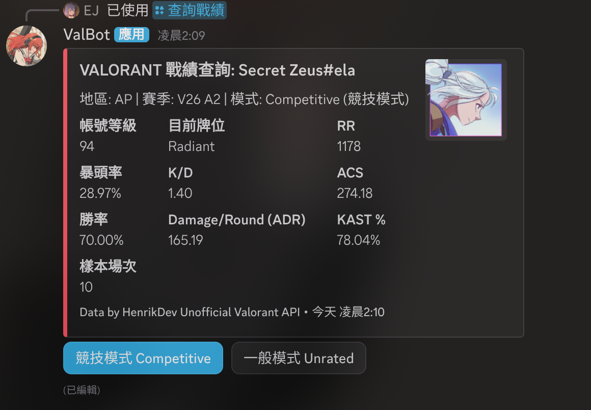

# ValBot

基於 [discord.js v14](https://discord.js.org/) 開發的多功能 Discord Bot，提供伺服器管理、事件紀錄與 Valorant 戰績查詢功能。

## 功能總覽

### 斜線指令

| 指令 | 說明 | 所需權限 |
|------|------|----------|
| `/ping` | 健康檢查，回應 Pong! | 無 |
| `/伺服器資訊` | 顯示在線/總人數、Bot 延遲（七段顯示器樣式） | 無 |
| `/clear` | 批次刪除頻道訊息（1–100 則） | Manage Messages |
| `/禁言` | 將成員 Timeout（1–40320 分鐘） | Moderate Members |
| `/解開禁言` | 解除成員禁言 | Moderate Members |
| `/查詢戰績` | 查詢 Valorant 玩家本季數據（Henrik API） | 無 |

#### `/查詢戰績` 功能展示

輸入玩家名稱與 Tag 後，Bot 會回傳該玩家本季的數據總覽（帳號等級、牌位、RR、暴頭率、K/D、ACS、勝率、ADR、KAST 等），並可透過下方按鈕切換 **競技模式 / 一般模式**。



### 自動事件紀錄

| 事件 | 說明 | 設定變數 |
|------|------|----------|
| 訊息刪除 | 記錄被刪除的訊息內容、作者、身分組 | `MESSAGE_DELETE_LOG_CHANNEL_ID` |
| 成員加入 | 記錄加入的成員與帳號資訊 | `MEMBER_LOG_CHANNEL_ID` |
| 成員退出 | 記錄退出的成員、停留時長、身分組 | `MEMBER_LOG_CHANNEL_ID` |
| 語音加入 | 記錄進入語音頻道的成員 | `VOICE_LOG_CHANNEL_ID` |
| 語音退出 | 記錄離開語音頻道的成員 | `VOICE_LOG_CHANNEL_ID` |
| 語音切換 | 記錄在頻道間移動的成員 | `VOICE_LOG_CHANNEL_ID` |

> Log 頻道變數若未設定，對應的紀錄功能將自動停用，不影響其他功能。

---

## 環境需求

- Node.js **20+**
- Discord Bot Token（[Discord Developer Portal](https://discord.com/developers/applications)）
- Henrik Valorant API Key（[HenrikDev API](https://app.henrikdev.xyz/)，`/查詢戰績` 功能必要）

---

## 快速開始

### 1. 安裝依賴

```bash
npm install
```

### 2. 設定環境變數

複製範本並填入你的資料：

```bash
cp .env.example .env
```

各變數說明見下方[環境變數說明](#環境變數說明)。

### 3. 啟動

本地開發（檔案異動自動重啟）：

```bash
npm run dev
```

正式環境：

```bash
npm start
```

---

## 環境變數說明

| 變數 | 必填 | 說明 |
|------|------|------|
| `DISCORD_TOKEN` | ✅ | Discord Bot Token |
| `CLIENT_ID` | ✅ | Discord 應用程式 ID（用於自動註冊斜線指令） |
| `GUILD_ID` | 建議 | 測試伺服器 ID（加速指令在特定伺服器更新） |
| `HENRIK_API_KEY` | `/查詢戰績` 必填 | Henrik 非官方 Valorant API 金鑰 |
| `MESSAGE_DELETE_LOG_CHANNEL_ID` | 選填 | 訊息刪除紀錄頻道 ID |
| `MEMBER_LOG_CHANNEL_ID` | 選填 | 成員加入/退出紀錄頻道 ID |
| `VOICE_LOG_CHANNEL_ID` | 選填 | 語音頻道進出紀錄頻道 ID |
| `ENABLE_SINGLE_INSTANCE_LOCK` | 選填 | 防止重複啟動，本地開發時可設為 `true`，**線上託管請保持 `false`** |

---

## Discord Developer Portal 設定

前往 [Developer Portal](https://discord.com/developers/applications) → 你的應用程式 → **Bot** → **Privileged Gateway Intents**，開啟以下兩個：

- **Server Members Intent**（成員加入/退出事件、禁言功能所需）
- **Presence Intent**（`/伺服器資訊` 在線人數所需）

> `GuildVoiceStates` 為非特權 Intent，無需額外開啟。

---

## 線上託管部署

Bot 為純 WebSocket 連線，**不需要開放任何 Port**，適合部署於以下平台：

### Railway（推薦）

1. 將此 repo push 到 GitHub
2. 前往 [Railway](https://railway.app/) → New Project → Deploy from GitHub repo
3. 在 **Variables** 頁籤填入所有環境變數
4. Railway 會自動偵測 `package.json` 並執行 `npm start`

### Render

1. 將此 repo push 到 GitHub
2. 前往 [Render](https://render.com/) → New → Background Worker
3. Build Command：`npm install`，Start Command：`npm start`
4. 在 **Environment** 填入所有環境變數

### Fly.io

```bash
fly launch
fly secrets set DISCORD_TOKEN=你的token CLIENT_ID=你的id ...
fly deploy
```

### 所有平台共同注意事項

- `ENABLE_SINGLE_INSTANCE_LOCK` 設為 `false`（預設值），避免平台重啟時誤判為重複實例
- 確認 Node.js 版本為 **20+**（本專案 `package.json` 已透過 `engines` 欄位聲明）

---

## 專案結構

```
src/
├── index.js                        # 入口：初始化 Client、掛載事件、註冊指令
├── commands/
│   ├── ping.js
│   ├── serverstats.js
│   ├── clear.js
│   ├── mute.js
│   ├── unmute.js
│   └── queryRecord.js              # Valorant 戰績查詢指令
├── controllers/
│   └── queryRecordController.js    # 查詢邏輯、快取、Session 管理、統計計算
├── services/
│   └── valorantApiService.js       # Henrik API HTTP 客戶端
├── events/
│   ├── messageDeleteLogger.js      # 訊息刪除紀錄
│   ├── memberLogger.js             # 成員加入/退出紀錄
│   └── voiceLogger.js              # 語音頻道進出紀錄
└── utils/
    └── segmentDisplay.js           # 七段顯示器格式化工具
```
